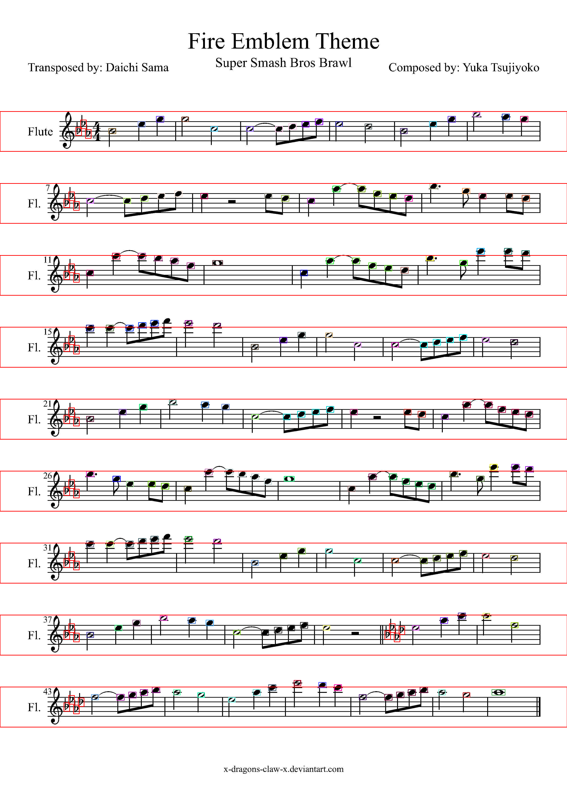
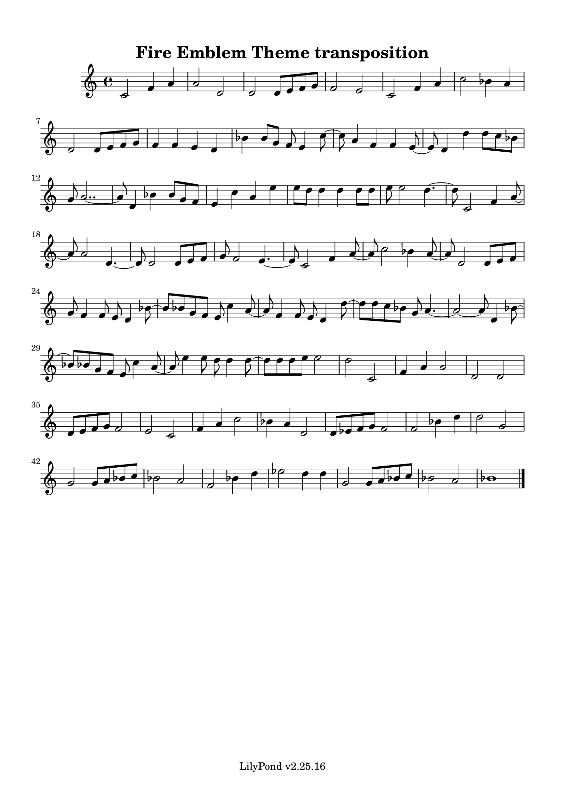

## Transiton-sheet

### Transposition is an important concept in music theory. It is used primarily for the following purposes

- Adjustment of vocal range: Transposition helps singers and performers to sing and play in their own vocal range. If a particular song is too high or too low for a singer or instrument, transposition can be used to adjust the range to one that is more comfortable for singing.

- Instrumental Tuning: Some instruments are easier to play in certain keys and more difficult in others. Transposition may be used to adjust the instrument to a key that is easier for the instrumentalist to play.

- Music tonal adjustment: The key of a piece of music can affect the mood and coloring of that piece. For example, playing the same melody in different keys can change the mood of the song. Transpositions can be used to adjust the mood and color of a song.

### Transposition software is a tool that automates these transposition tasks. In general, they offer the following advantages

- Fast and accurate transposition: Instead of manually changing the score, transposition software allows you to transpose a piece of music to another key quickly and accurately.
- Versatility: In addition to transposing a piece of music, transposition software may also include a variety of other features, such as speed changes, voice adjustments, and more.
- Flexibility and convenience: Transposition software allows any key to be selected, allowing performers and singers to play songs in the key that suits them best.

Overall, transposition is an important means of making music more accessible and more comfortable for performers and singers. And transposition software streamlines the process, providing flexibility and convenience.

## This is Sheet Vision Remake
First Author is [Calvin Gregory, and Calvert Pratt](https://github.com/cal-pratt/SheetVision)

### I.	How to do Transition
Change the variable named semitones in main.py. Each time this variable is raised by 1, the semitone is raised by a semitone. Conversely, setting it to -1 lowers it by a semitone.
The default value is 2.

### II.	Connect Your Path
In main.py, there is a string that says 'path_to_your_lilypond'. Rewrite it here to the location where your lilypond program resides.

------------------

#### Libraries sourced from http://www.lfd.uci.edu/~gohlke/pythonlibs/
- (for x64)
  - numpy-1.11.1+mkl-cp35-cp35m-win_amd64.whl
  - matplotlib-1.5.2-cp35-cp35m-win_amd64.whl
  - opencv_python-3.1.0-cp35-cp35m-win_amd64.whl
- (for x86) 
  - numpy-1.11.1+mkl-cp35-cp35m-win32.whl
  - matplotlib-1.5.2-cp35-cp35m-win32.whl
  - opencv_python-3.1.0-cp35-cp35m-win32.whl

Midiutil Python 3 version is included in this repo
